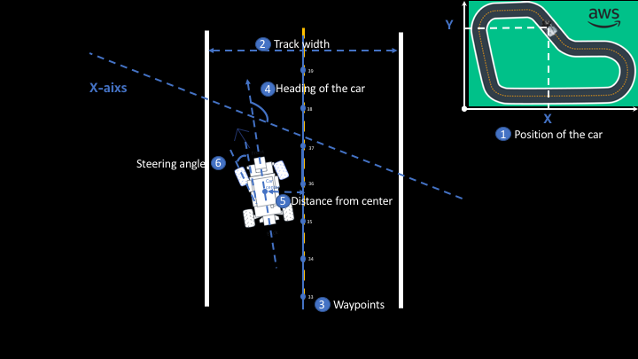
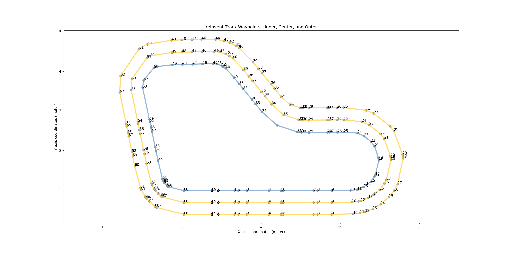
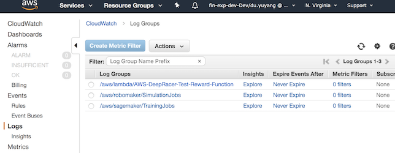

# Reward Function

In reinforcement learning, the reward function plays a **critical** role in training your models. The reward function is used to incentivize the driving behavior you want the agent to exhibit when using your trained RL model to make driving decisions.

The reward function evaluates the quality of an action's outcome, and rewards the action accordingly. In practice the reward is calculated during training after each action is taken, and forms a key part of the experience (recall we spoke about state, action, next state, reward) used to train the model. You can build the reward function logic using a number of variables that are exposed by the simulator. These variables represent measurements of the car, such as steering angle and speed, the car in relation to the racetrack, such as (x, y) coordinates, and the racetrack, such as waypoints. You can use these measurements to build your reward function logic in Python 3 syntax.

## Input Parameters

```python
def reward_function(params):

  # Read input parameters
  all_wheels_on_track = params['all_wheels_on_track']
  distance_from_center = params['distance_from_center']
  is_left_of_center = params['is_left_of_center']
  heading = params['heading']
  speed = params['speed']
  progress = params['progress']
  steps = params['steps']
  steering_angle = params['steering_angle']
  track_width = params['track_width']
  x, y = params['x'], params['y']
  waypoints = params['waypoints']
  closest_waypoints = params['closest_waypoints']
```

| Variable Name | Syntax | Type | Description |
|---------------|--------|------|-------------|
| all_wheels_on_track  | params['all_wheels_on_track']  | Boolean  | If all of the four wheels is on the track, where track is defined as the road surface including the border lines, then all_wheels_on_track is True. If any of the four wheels is off the track, then all_wheels_on_track is False. Note if all four wheels are off the track, the car will be reset.              |
| x                    | params['x']                                            | Float                    | Returns the x coordinate of the center of the front axle of the car, in unit meters. |
| y                    | params['y']                                            | Float                    | Returns the y coordinate of the center of the front axle of the car, in unit meters.  |
| distance_from_center | params['distance_from_center'] | Float [0, track_width/2] | Absolute distance from the center of the track. Center of the track is determined by the line that links all center waypoints. |
| is_left_of_center    | params['is_left_of_center']                                          | Boolean                  | A variable that indicates if the car is to the left of the center of the track.    |
| heading              | params['heading']  | Float (-180,180]           | Returns the heading the car is facing in degrees. When the car faces the direction of the x-axis increasing (and y constant), then it will return 0. When the car faces the direction of the y-axis increasing (with x constant), then it will return 90. When the car faces the direction of the y-axis decreasing (with x constant), then it will return -90. |
| speed                | params['speed']      | Float                    | The desired speed of the car in meters per second. This should tie back to the selected action space. |
| progress             | params['progress']                                  | Float [0,100]            | Percentage of the track complete. Progress of 100 indicates the lap is completed.|
| steps                | params['steps']    | Integer [0,inf]                 | Number of steps completed. One step is one (state, action, next state, reward tuple).|
| steering_angle       | params['steering_angle']                                                              | Float                    | The desired steering_angle of the car in degrees. This should tie back to the selected action space. Note that + angles indicate going left, and negative angles indicate going right. This is aligned with 2d geometric processing.|
| track_width          | params['track_width']                                                                 | Float                    | The width of the track, in unit meters.      |
| waypoints            | params['waypoints'] for the full list or params['waypoints'][i] for the i-th waypoint | List                     | Ordered list of waypoints, that are spread around the track in the center of the track, with each item in the list being the (x, y) coordinate of the waypoint. The list starts at zero. |
| closest_waypoints    | params['closest_waypoints'][0] or params['closest_waypoints'][1]                      | Integer                  | Returns a list containing the nearest previous waypoint index, and the nearest next waypoint index. params['closest_waypoints'][0] returns the nearest previous waypoint index and params['closest_waypoints'][1] returns the nearest next waypoint index.|

### Visual explanation of some of the reward function parameters



### Visualization of the waypoints at re:invent



You can get waypoints by

```python
print(waypoints)
```

### Check out CloudWatch logs for the output



## Hints

- Once you are done creating your reward function be sure to use the Validate button to verify that your code syntax.
- You can use the waypoints to calculate the direction from one waypoint to the next.
- You can use the right-hand rule from 2D gaming to determine on which side of the track you are on.
- You can scale rewards exponentially, just cap them at 10,000.
- Keep your action space in mind when using speed and steering_angle in your reward function
- To keep track of episodes in the logs where your car manages to complete a lap, consider giving a finish bonus (aka reward += 10000) where progress = 100. This is because once the car completes a lap progress will not go beyond 100, but the simulation will continue. The model will keep on training until it reaches the stopping time, but that does not imply the final model is the best model, especially when it comes to racing in the real world. This is a temporary workaround as we will solve.
