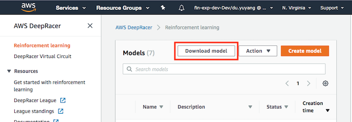

# Upload your model

1. Select the model and click on the "Download model" button to download it to your laptop. AWS console will take about 1 minute to proceed, then a <model>.tar.gz file will be downloaded.



2. Rename the model file to <player name>.tar.gz

3. Use aws command line to upload the model to a s3 bucket.

[How to install awscli](https://docs.aws.amazon.com/cli/latest/userguide/cli-chap-install.html)
[How to install rea-as](https://git.realestate.com.au/cowbell/rea-as)

Contact our crew member if you have trouble with the tools.

```bash
# authenticate
rea-as saml REAio bash

# upload
aws s3 cp <player name>.tar.gz s3://deepracer-custom-models/
```

4. The model will be processed through a queue as first in first out. You're free to upload as many times as you want at anytime during REAio. The new model will **override** the old version, before our crew member loading it to the car. You can rename the model with version number to avoid overriding the model.

5. Our crew member will run the car for 3 laps, the fastest complete lap wins.